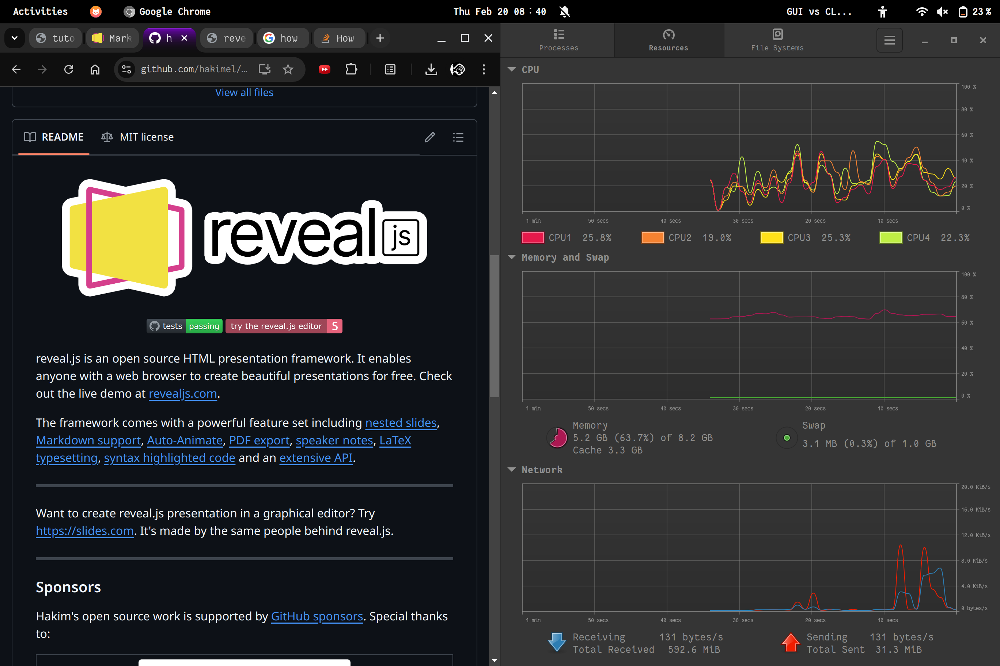

# Linux Shell Tutorial

* 2025-02-XX
* ygLi, yxLi

------

## 0. Linux Shell

* Brief Intro: all you need to know about starting using a CLI.
* Basic but useful command line tools.
* How to write a bash scripts and what can those scripts do?

---

### Target

1. Using **shell** to get the work done (doing experiment, coding, etc.) efficiently.
2. Using **bash** script.
3. 😍 The `man`.

------

## 1. GUI vs CLI

which is better?

https://www.computerhope.com/issues/ch000619.htm

<div style="display: contents; justify-content: space-between; align-items: center;">
    
    
</div>

---

### Why CLI is all you need?

1. **Hackers** use CLI (CLI is cool 😎)
2. Some times, **GUI is not available** (e.g. server, embedded system). And many powerful tools are CLI only (e.g. `git`, `ssh`, `vim`)
3. CLI is more **efficient** (e.g. `mv` v.s. drag and drop)
4. CLI is more **flexible** and **programmable** (e.g. `>`, `|`, `&&`)
5. [UNIX philosophy](https://en.wikipedia.org/wiki/Unix_philosophy): "Do one thing and do it well"

------

## 2. Shell

The system user-interface in CLI.
Just like the Desktop in GUI world (from user’s view).

* Launch app
* execute command
* manage foreground/background tasks

---

### Basic Setup

* Terminal (emulator): emulate a (texted-based) terminal inside the GUI environment.

* *Try the tty: `Ctrl + Alt + F1` (F1-F6, in linux)*

* SSH to server:
    * `ssh <your stuid>-ics@igw.dfshan.net -p2291`
    * Strong password or use ssh key to login
    * Keyboard shortcuts
        * `ctrl + r` (to find history), `tab` (to autofill)
        * `ctrl + c` (to kill `SIGINT`)


---

### What's SHELL?

Knowledge chain of the first time you heard the word "Shell":

1. What's Shell?
2. Ah, the black screen with white text
3. Open the shell in a software called Terminal
4. Bash is a kind of shell in Linux
5. <u>***Shell? Terminal? Console? Bash? CMD? CLI? .... ?***</u>
6. 🤯

*Google for historical reasons*

------

## 3. Bash Shell

本节中，我们专注 bash 脚本 (`echo $SHELL`)
bash 是 Bourne Again Shell 的缩写，它是大多数 Linux 系统默认的 shell。

```bash[0:]
echo "Hello, Shell"

cmatrix

sudo tree /

sl -e

...
```

(*一行代码让你变成黑客*)

---

### Basic Tools (Commands)

```bash
command-name arg1 arg2 arg3 ... # Basic format
```

* Directories: `pwd`, `cd`, `mkdir`
* File: `touch`, `cp`, `mv`, `rm`, `cat`, `less`
* Simple functions: `sort`, `wc`, `echo`
* Others: `grep`, `chmod`
* Code Editor: `vim`
* Keep the connection: `tmux`, `screen`, etc.


---


### `Tar`

Usage Scenario: archive files in 1 bundle

* `-c`: create a tarball
* `-x`: open a tarball
* `-v`: verbose mode [displays progress]
* `-f`: specify file name

```bash[0:]
tar -cf name-of-archive.tar /path/to/dir/ # compress directory
tar -cf name-of-archive.tar /path/to/filename # compress file
tar -cf name-of-archive.tar dir1 dir2 dir3 # compress multiple dirs
tar -xf name-of-archive.tar # open a tar file in current directory
```

---

### SO MANY COMMAND 😭

* `-h`, `--help`
* `man` - man is the system's manual pager (<u>Ask the man XD</u>)
    * `man -k ipc`
    * `man man`
    * Some of the following command can be found their manpage, but how about `cd` ?
* `tldr` - https://github.com/tldr-pages/tldr
    * There is room for simpler help pages focused on practical examples.
    * `man tar` v.s. `tldr tar`

---


### Install Software in CLI

1. Package manager: `apt` (ubuntu, Debian), `brew`(macOS), `dnf`(fedora)
    * Search (e.g. `apt search`)
    * https://command-not-found.com/

2. [Build from source](https://github.com/abishekvashok/cmatrix) (no suitable version, or need to modify their code)
    * README/INSTALL doc
    * configure and make install

---

### Communication: Pipe

* A lot of CLI tools, communication is required to do complex jobs.
* Pipe: `|` use the `stdout` of previous command as the `stdin` of the next.
    * `ls -l | grep 22[01234] | wc -l`


---


### Communication: Redirect 1

* A lot of CLI tools, communication is required to do complex jobs.
* Redirect: `>` & `<`, `stdout` to file or file to `stdin` (normally).


---

### Communication: Redirect 2

* A lot of CLI tools, communication is required to do complex jobs.
    * 0 - `stdin`, the standard input stream.
    * 1 - `stdout`, the standard outr55.,mjyput stream.
    * 2 - `stderr`, the standard error stream.


---

### Combining Commands

```bash[0:]
ls -l | grep 22[01234] | wc -l # count stu number

find . -name "*.[ch]" | xargs grep "#include" | sort | uniq # include files

diff <(ls -a ../yxli) <(ls -a ../ykliu)

du -sc /usr/bin/* | sort -nr | less

find . -type f -name "*.sh" -print0 | xargs -d "\0" zip -r shell.zip

strace ./hello |& grep write # strace ./hello > /dev/null, strace ./hello 2> /dev/null
```


---

### Further More

* 多找那个男人 `man`


------

## 4. Shell Scripts


我们已经学习了如何在 `shell` 中执行命令，并使用管道将命令组合使用。
但是，很多情况下我们需要执行一系列的操作并使用条件或循环这样的控制流。

`shell` 脚本与其他脚本语言不同之处在于，`shell` 脚本针对 `shell` 所从事的相关工作进行了优化。
因此，创建命令流程（`pipelines`）、将结果保存到文件、从标准输入中读取输入，这些都是 `shell` 脚本中的原生操作，这让它比通用的脚本语言更易用。

---

### Shell Script? Bash Script

大多数 shell 都有自己的一套脚本语言，包括变量、控制流和自己的语法。


---

### Variables

在 `bash` 中为变量赋值的语法是 `foo=bar`，访问变量中存储的数值，其语法为 `$foo`

需要注意的是:
1. `foo = bar`（使用空格隔开）不能正确工作: 因为解释器会调用程序 `foo` 并将 `=` 和 `bar` 作为参数。
2. **在 `shell` 脚本中使用空格会起到分割参数的作用**

---

### Strings

`Bash` 中的字符串通过 `'` 和 `"` 分隔符来定义，但是它们的含义并不相同:

* 以 `'` 定义的字符串为原义字符串，其中的变量不会被转义
* 而 `"` 定义的字符串会将变量值进行替换。

```bash
foo=bar
echo "$foo" # 打印 bar
echo '$foo' # 打印 $foo
```

---

### Functions


和其他大多数的编程语言一样, `bash` 也支持 `if`, `case`, `while` 和 `for` 这些控制流关键字。
同样 `bash` 也支持函数，它可以接受参数并基于参数进行操作。

下面这个函数是一个例子, 这里 `$1` 是脚本的第一个参数:

```bash
# 创建一个文件夹并进入该文件夹
mcd () {
    mkdir -p "$1"
    cd "$1"
}
```

与其他脚本语言不同的是，`bash` 使用了很多特殊的变量来表示<u>参数</u>、<u>错误代码</u>和<u>相关变量</u>

---

### Special Variables

下面列举一些变量:

* `$0` : 脚本名  
* `$1` ~ `$9` : 脚本的参数。 `$1` 是第一个参数，依此类推
* `$@` : 所有参数
* `$#` : 参数个数
* `$?` : 前一个命令的返回值  
* `$$` : 当前脚本的进程识别码  
* `!!` : 完整的上一条命令，包括参数。常见应用：当你因为权限不足执行命令失败时，可使用 `sudo !!` 再试一次。 
* `$_` : 上一条命令的最后一个参数

---

### Short Circuiting

退出码可以搭配 &&（与操作符）和 ||（或操作符）使用，用来进行条件判断，决定是否执行其他程序。
它们都属于**短路运算符（short-circuiting）**。
同一行的多个命令可以用 `;` 分隔。
程序 true 的返回码永远是 0，false 的返回码永远是 1。

```bash
false || echo "Oops, fail"  
# Oops, fail

true || echo "Will not be printed"  
#

true && echo "Things went well"  
# Things went well

false && echo "Will not be printed"  
#

false ; echo "This will always run"  
# This will always run
```

---

### [Shabang](https://en.wikipedia.org/wiki/Shebang_(Unix))

* `shabang` 是一个特殊的注释，用来告诉系统使用哪个解释器来执行脚本

* [`#! + <Path of interpreter>`]() e.g.: `#!/bin/bash`, `#!/usr/bin/python`

```bash
#!/bin/bash
echo "Hello, World!"
```

```bash
#!/usr/bin/env python3
# use env to find python3 in PATH
print("Hello, World!")
```

------

## The Best Way to Learn it , is to use it.

## Happy Shell-ing `XD`

> * MIT - [The Missing Semester](https://missing-semester-cn.github.io/)
> * USTC - [Linux101](https://101.ustclug.org/)
> * [The Art of Command Line](https://github.com/jlevy/the-art-of-command-line)

