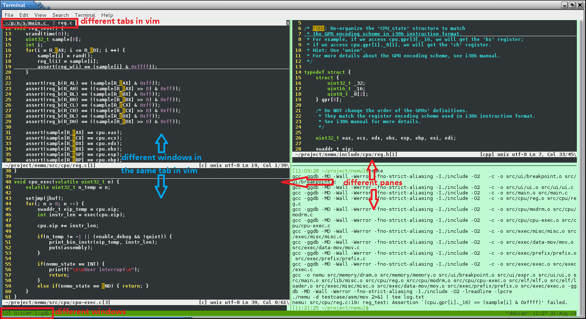

# `Shell` Tutorial

* 2025-03
* [ICS@XJTU](https://xjtu-ics.github.io/)
*  Yunguang Li, Tang Tang, Yuxuan Li

***A brief tutorial for beginners**, so feel free to absent if you are familiar with shell* 🙉🙈


---

### Interactive with Computer System


As we all know, there are many ways to interact with a computer system: GUI, CLI, AR, VR, etc.


<div style="display: contents; justify-content: space-between; align-items: center;">
    
</div>

As a human being, we are more familiar with GUI, but CLI is also very powerful and efficient.


---

### Why should I use CLI?

1. Some times, **GUI is not available** (e.g. server, embedded system). And many powerful tools are CLI only (e.g. `git`, `ssh`, `vim`)
2. CLI is more **efficient** (e.g. `mv` v.s. drag and drop)
3. CLI is more **flexible** and **programmable** (e.g. `>`, `|`, `&&`)
4. <u>***ICS*** hopes you to use CLI 😂</u>

` `

### Overview


1. **Brief Intro**: all you need to know about starting using shell.
2. **Recommend**: basic but useful command line tools.
3. **Automation**: write a bash scripts.
- ***RTFM**: use `man` and `tldr`.*


------

## 1. Basic Setup

1. Terminal (emulator): emulate a (texted-based) terminal inside the GUI environment.
    * Linux: `kitty`, `gnome-terminal`, `konsole`, `xterm`, `terminator`, etc.
    * Windows: `Windows Terminal`
    * *Open `vscode` and `Ctrl + ~`*

2. `SSH` to server:
    * `ssh <your stuid>-ics@igw.dfshan.net -p2291`

3. ***Try the tty: `Ctrl + Alt + F1` (F1-F6, in some Linux distros)***

**[The TTY demystified](https://www.linusakesson.net/programming/tty/)**


------

## 2. Shell: The "Shell" of the Kernel

We fouce on [`bash shell`](https://www.gnu.org/software/bash/)
* `echo $0`


```bash
command-name arg1 arg2 arg3 ... # Basic format
```

<table>
   <tr>
    <td><b>DO -</b></td>
	<td><b>In GUI</b></td>
	<td><b>In CLI (bash shell)</b></td>
   </tr>
   <tr>
	<td>Create a file</td>
	<td>Right click, New file</td>
	<td><code>touch filename</code></td>
   </tr>
   <tr>
	<td>Move a file</td>
	<td>Drag and drop</td>
	<td><code>mv file1 file2</code></td>
   </tr>
   <tr>
	<td>Launch an app</td>
	<td>Click icon</td>
	<td><code>./app</code></td>
   </tr>
   <tr>
	<td>Quit an app</td>
	<td>Click close button</td>
	<td><code>Ctrl + C</code></td>
   </tr>
   <tr>
	<td>Suspend an app</td>
	<td>Minimize</td>
	<td><code>Ctrl + Z</code></td>
   </tr>
   <tr>
    <td>Show background process</td>
    <td>Task Manager</td>
    <td>jobs</td>
   <tr>
    <td>Background to foreground</td>
    <td>alt+tab</td>
    <td>fg %n</td>
    </tr>
</table>


---

### Basic Tools (Commands)

* Directories: `pwd`, `cd`, `mkdir`
* File: `touch`, `cp`, `mv`, `rm`, `cat`, `less`
* Simple functions: `sort`, `wc`, `echo`
* Others: `grep`, `chmod`
* Code Editor: `vim`
* monitor: `top`, `htop`
* Network: `ping`, `ssh`, `scp`


---


### `Tar`

Usage Scenario: archive files in 1 bundle

* `-c`: create a tarball
* `-x`: open a tarball
* `-v`: verbose mode [displays progress]
* `-t`: list files in a tarball
* `-f`: specify file name

**`-f` is always the last option**

```bash[0:]
tar -cf name-of-archive.tar /path/to/dir/ # compress directory
tar -cf name-of-archive.tar /path/to/filename # compress file
tar -cf name-of-archive.tar dir1 dir2 dir3 # compress multiple dirs
tar -xf name-of-archive.tar # open a tar file in current directory
```

---

### `Tmux`

Usage Scenario: manage multiple terminal sessions




* prefix key: `Ctrl + b`
* Client-Server model: `tmux` (server) + `tmux attach` (client)

---

### `grep`

Usage Scenario: search for a specific string in a file

`grep + regex`

* `-i`: case insensitive
* `-r`: recursive search
* `-n`: show line number
* `-v`: invert match

```bash[0:]
grep -i "hello" file.txt # search for "hello" in file.txt
grep -r "hello" . # search for "hello" in all files in current directory
grep -r "hello" . -n # search for "hello" in all files in current directory and show line number
grep -r "hello" . -v # search for files that do not contain "hello" in current directory
```

---

### Interlude: SO MANY COMMAND 😭

* `-h`, `--help`
* `man`: man is the system's manual pager (<u>Ask the man XD</u>)
    * `man -k ipc`
    * `man man`
    * Some of the following command can be found their manpage, but how about `cd` ?
* `tldr`: https://github.com/tldr-pages/tldr
    * There is room for simpler help pages focused on practical examples.
    * `man tar` v.s. `tldr tar`

---

### `Find`

Usage Scenario: search files in a directory

* `-name`: search by name
* `-type`: search by type
* `-exec`: execute command on each file found

```bash[0:]
find . -type f -name "*.txt" # find all txt files in current directory
find . -type f -name "*.txt" -exec cat {} \; # cat all txt files in current directory
```

---

### More Tools

- `awk`: a powerful pattern scanning and processing language
- `sed`: a stream editor for filtering and transforming text
- `curl`: transfer data from or to a server
- `ag`: a code-searching tool similar to `grep`
- `tree`: list contents of directories in a tree-like format
- `htop`: an interactive process viewer for Unix
- `cmatrix`: a program that simulates the display from "The Matrix"
- `sl`: a steam locomotive runs across your terminal


---

### Install Software in CLI

1. Package manager: `apt` (ubuntu, Debian), `brew`(macOS), `dnf`(fedora), `pacman`(arch)
    * Search (e.g. `apt search`)
    * https://command-not-found.com/

2. [Build from source](https://github.com/abishekvashok/cmatrix)
    * README/INSTALL doc
    * configure and make install

---


### Communication: Pipe

* A lot of CLI tools, communication is required to do complex jobs.
* Pipe: `|` use the `stdout` of previous command as the `stdin` of the next.


---


### Communication: Redirect 1

* A lot of CLI tools, communication is required to do complex jobs.
* Redirect: `>` & `<`, `stdout` to file or file to `stdin` (normally).


---

### Communication: Redirect 2

* A lot of CLI tools, communication is required to do complex jobs.
    * 0 - `stdin`, the standard input stream.
    * 1 - `stdout`, the standard outr55.,mjyput stream.
    * 2 - `stderr`, the standard error stream.


---

### Combining Commands (Further More)

1. Count students number in server
2. fetch all include file
3. diff between two directories
4. check the disk usage of all files in /usr/bin

> * `xargs`
> * `<()`: temporary file
> * `$()`: command substitution

* Build a temporary tools combination
* We a programming
    * a "Natural programming language"
    * Cooprate tools togather


------

## 3. Shell Scripts


Shell is also a programming language, which allows you to combine a series of commands and execute


---

### Variables

In `bash`, the syntax for assigning a value to a variable is `foo=bar`, and to access the value stored in a variable, the syntax is `$foo`.

Notes:
1. `foo = bar` (with spaces around `=`) will not work: the interpreter will try to run a program `foo` with `=` and `bar` as arguments.
2. **In `shell` scripts, spaces are used to separate arguments.**

---

### Strings

In `Bash`, strings can be defined using `'` and `"`, but they have different meanings:

* Strings defined with `'` are literal strings, where variables are not replaced.
* Strings defined with `"` are strings where variables are replaced with their values.
* read more in Official [Bash Manual](https://www.gnu.org/software/bash/manual/html_node/Quoting.html)


```bash
foo=bar
echo "$foo" # print bar
echo '$foo' # print $foo
```

---

### Control Structures


```bash
if [ expression ]; then
    # do something
elif [ expression ]; then
    # do something
else
    # do something
fi
```

```bash
for i in 1 2 3 4 5; do
    echo $i
done
```

```bash
while [ expression ]; do
    # do something
done
```
---

### test

```bash
test expression

[ expression ]

[[ expression ]]
```

* [ -e file ]：if file exists, then true.
* [ string ]：if string is not empty (length > 0), then true.
* [ string1 != string2 ]：if string1 and string2 are different, then true.
* [ integer1 -eq integer2 ]：if integer1 equals to integer2, then true.
    * **do not confuse with numeric and string comparison**


---


### Functions


```bash
mcd () {
    mkdir -p "$1"
    cd "$1"
}
```

---

### Special Variables

Different from other scripting languages, `bash` uses many special variables to represent <u>parameters</u>, <u>error codes</u>, and <u>related variables</u>

* `$0` : script name
* `$1` ~ `$9` : script parameters. `$1` is the first parameter, and so on.
* `$@` : all parameters
* `$#` : number of parameters
* `$?` : return value of the previous command
* `$$` : process ID of the current script
* `!!` : the last command, including parameters. Common usage: when you fail to execute a command due to insufficient permissions, you can use `sudo !!` to try again.
* `$_` : the last parameter of the last command

---


### [Shabang](https://en.wikipedia.org/wiki/Shebang_(Unix))

* `shabang` (`#!`) is a special comment that tells the system which interpreter to use to execute the script
* [`#! + <Path of interpreter>`](https://en.wikipedia.org/wiki/Shebang_(Unix))

```bash
#!/bin/bash
echo "Hello, World!"
```

```bash
#!/usr/bin/env python3
# use env to find python3 in PATH
print("Hello, World!")
```


---

### `builtin`

* `source` or `.`: run commands in the current shell
* `cd`: change directory
* ..., read more in `man bash-builtins`

------


## $. The Best Way to Learn it , is to use it.

"Unix is user-friendly; it's just choosy about who its friends are."

* MIT - [The Missing Semester](https://missing-semester-cn.github.io/)
* USTC - [Linux101](https://101.ustclug.org/)
* [The Art of Command Line](https://github.com/jlevy/the-art-of-command-line)

